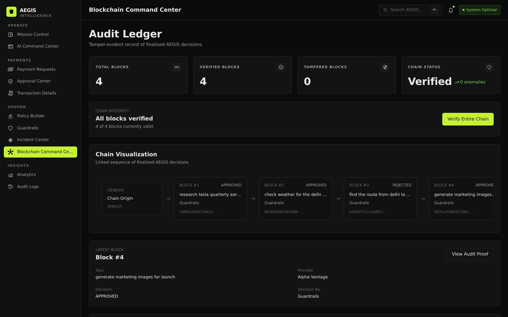
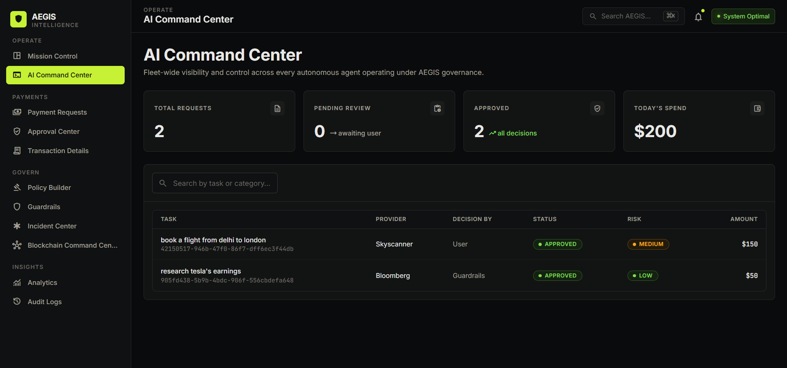
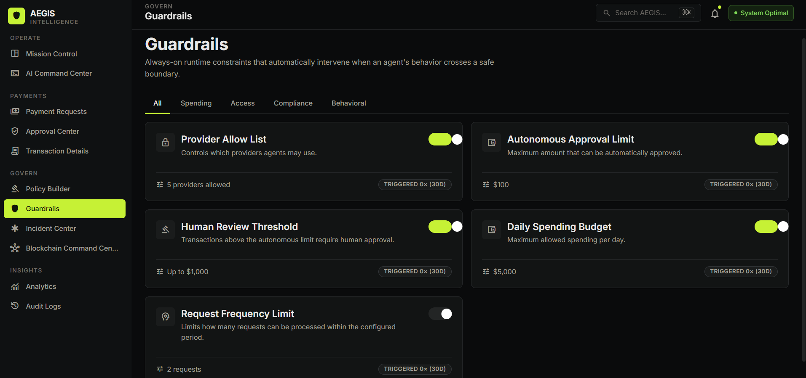
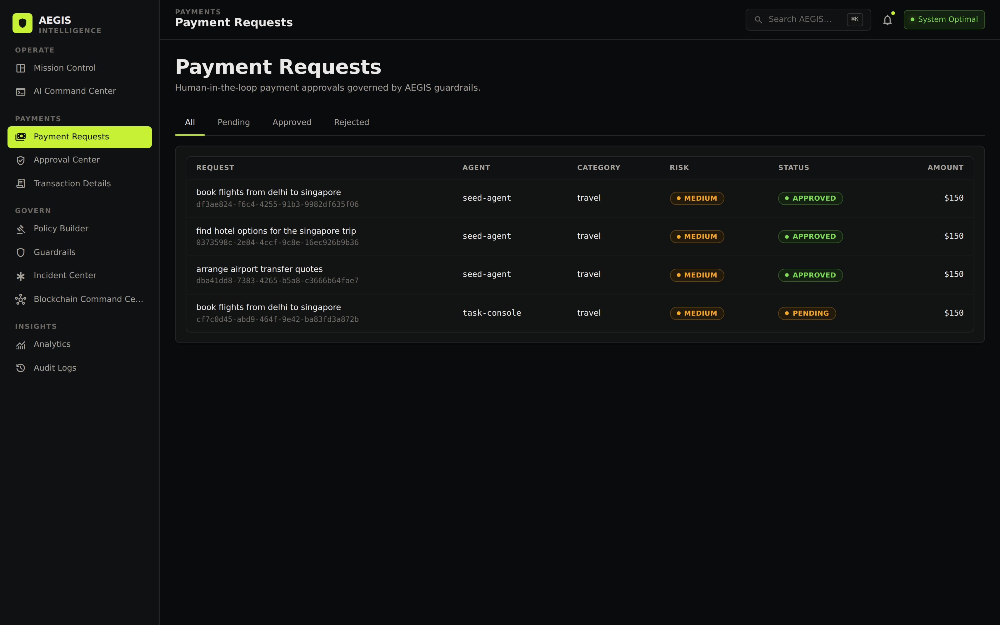
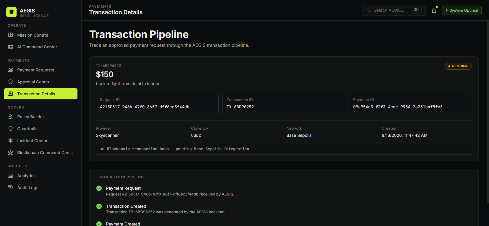
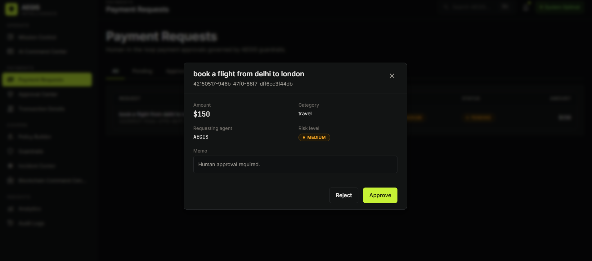

🛡️ AEGIS — AI Agent Payment Governance

A policy **enforcement point** for autonomous AI-agent payments.

AEGIS sits between AI agents and the services they pay for. Agents hold no
credentials — they submit an intent, and AEGIS evaluates it against
configurable policy and, only if allowed, makes the paid call itself.

The distinction matters. A layer agents *report to* is advisory: an agent that
never asks is unaffected. A layer that *holds the only credential* is
enforceable, and refusing requires no cooperation from the agent.

    We don't stop prompt injection. We make it financially inert.

See `docs/ARCHITECTURE.md` for how that works, and run the demo below to watch
it happen.

## ⚡ The 60-second demo

    cd backend
    pip install -r requirements.txt
    python demo_injection.py

Runs a real agent through the same prompt-injection attack four times —
holding its own wallet, behind AEGIS, against a legitimate provider, and
finally attacking the guard itself. No server and no API key needed.

## 🧪 Tests

    cd backend
    python -m pytest test_guard.py -v

67 tests: the guard's security properties, the agent, behavioural risk
scoring, the live credential-injected call path, on-chain anchoring
(signing and signature recovery included), and every bug this work fixed.
Each regression test fails against the previous implementation.


🚨 Problem

As AI agents become increasingly autonomous, they can also initiate financial transactions with limited human intervention. This introduces risks such as:

Unauthorized spending

Excessive or budget-breaking payments

Unintended transactions

Repeated or duplicate transactions

Transactions with untrusted providers

Limited visibility into agent-driven financial activity

💡 Solution

AEGIS evaluates every payment request against configurable financial and risk policies before it reaches transaction execution.

AI Agent → Payment Request → Policy Evaluation → Guardrails
                    ↓
       Approve / Human Approval / Reject
                    ↓
             Payment Execution
                    ↓
              Settlement
                    ↓
         Transaction & Audit Records

✨ Key Features

🤖 AI Agent Governance — Monitor and control payment activity initiated by autonomous agents.

💳 Payment Request Management — View agent, provider, amount, category, risk level, and status.

🛡️ Policy Builder & Guardrails — Spending limits, provider allowlists, frequency limits, category limits, daily budgets, and risk rules.

👤 Human-in-the-Loop Approvals — Route legitimate but higher-risk transactions for human authorization.

⚡ Automated Decisions — Approved, Human Approval Required, or Rejected.

⛓️ Blockchain Monitoring — Track transaction IDs, hashes, network details, settlement status, and timestamps.

📊 Analytics & Auditability — Monitor payments, decisions, incidents, transactions, and system activity.

📸 Project Screenshots

The repository includes screenshots of the main AEGIS interfaces.

⛓️ Blockchain Command Center



🎛️ Command Center



🛡️ Guardrails



📋 Policy Builder


💳 Payment Requests



🔎 Transaction Details



👤 Human Approval



🏗️ Architecture

                         ┌─────────────────┐
                         │    AI AGENTS    │
                         └────────┬────────┘
                                  ↓
                         ┌─────────────────┐
                         │ PAYMENT REQUEST │
                         └────────┬────────┘
                                  ↓
                 ┌────────────────────────────────┐
                 │        AEGIS GOVERNANCE        │
                 │ Policy Engine • Guardrails     │
                 │ Risk Evaluation • Approval     │
                 └───────────────┬────────────────┘
                                 ↓
                    ┌────────────┼────────────┐
                    ↓            ↓            ↓
                 APPROVE      REVIEW        REJECT
                    │            │
                    └──────┬─────┘
                           ↓
                  ┌─────────────────┐
                  │ PAYMENT EXECUTION│
                  └────────┬────────┘
                           ↓
                  ┌─────────────────┐
                  │ SETTLEMENT /    │
                  │ BLOCKCHAIN      │
                  └────────┬────────┘
                           ↓
                  ┌─────────────────┐
                  │ AUDIT & ANALYTICS│
                  └─────────────────┘

🧰 Technology Stack

Layer

Technology

Frontend

React, TypeScript, Vite, Tailwind CSS

Backend

Python, FastAPI

AI / Agent Components

LangChain + Groq — used for policy suggestions only. Enforcement is deterministic; an LLM never decides whether to release money.

Governance

Custom Policy Engine + Guardrail Engine

Payments

x402-style payment lifecycle

Blockchain

Hash-linked decision ledger, optionally anchored on Base Sepolia. Settlement is simulated — no funds move.

Database

SQLite — implemented; requests, payments and decisions persist across restarts

APIs

REST

Version Control

Git + GitHub

Deployment

Render

📁 Project Structure

```
Aegis/
├── backend/
│   ├── guard.py              # THE ENFORCEMENT POINT — one path money can take
│   ├── agent.py              # a real agent whose only spend route is the guard
│   ├── risk.py               # behavioural risk scoring (no LLM)
│   ├── credentials.py        # secret custody; agents never hold a key
│   ├── identity.py           # control plane / data plane separation
│   ├── catalog.py            # service catalog + payee boundary
│   ├── guardrails.py         # the policy engine (deterministic)
│   ├── policy_store.py       # active policy configuration
│   ├── policy_builder.py     # LLM proposes amendments; never applies them
│   ├── blockchain.py         # hash-linked decision ledger
│   ├── anchor.py             # Base Sepolia anchoring (optional)
│   ├── anchor_preflight.py   # verify anchoring works, spend nothing
│   ├── store.py              # SQLite persistence
│   ├── request_history.py    # records + derived spend/frequency
│   ├── seed.py               # historical demo data
│   ├── config.py             # env-driven configuration
│   ├── selector.py           # legacy entry point -> guard
│   ├── main.py               # FastAPI routes
│   ├── demo_injection.py     # ▶ the demo — runs without a server
│   ├── test_guard.py / test_agent.py / test_anchor.py   # 67 tests
│   ├── api_catalog.json / keyword_map.json / blockchain.json
│   ├── requirements.txt / .env.example
│   └── x402/                 # payment lifecycle (simulated settlement)
├── frontend/
│   ├── src/config.ts         # single source for API URL + credentials
│   └── src/…                 # pages, services, components
├── docs/
│   ├── ARCHITECTURE.md       # how the guard works
│   ├── API.md                # endpoint reference
│   ├── SETUP.md              # install, config, deployment
│   ├── OPERATING.md          # using the dashboard
│   └── DEMO.md               # demo runbook
└── screenshots/
```

## 📚 Documentation

| Doc | For |
|---|---|
| [ARCHITECTURE.md](docs/ARCHITECTURE.md) | How enforcement works, and why it's a guard rather than a dashboard |
| [API.md](docs/API.md) | Every endpoint, auth, request/response examples |
| [SETUP.md](docs/SETUP.md) | Install, configure, deploy, troubleshoot |
| [OPERATING.md](docs/OPERATING.md) | Operator guide — reading decisions, approving requests, guardrails |
| [DEMO.md](docs/DEMO.md) | Demo runbook and anticipated questions |
| [deck/](docs/deck/) | The pitch deck — open `docs/deck/index.html` |

💳 x402 Integration

x402 is an HTTP-native approach to programmatic payments built around the 402 Payment Required mechanism.

AEGIS uses an x402-style payment lifecycle within its governance and transaction workflow:

Payment Required → Authorized → Verified → Settling → Settled

🔗 The guard (formerly "planned x402 gateway")

Built. AEGIS sits between agents and providers rather than beside them:

```
AI Agent  (holds no credentials)
   ↓  submits an intent
AEGIS GUARD
   ↓  frequency → provider → budget → amount
Policy + Guardrails
   ↓  approve · escalate · block
Credential injection  (the agent never sees the key)
   ↓
Payment lifecycle → Settlement (simulated)
   ↓
Tamper-evident ledger → optional Base Sepolia anchor
```

The agent cannot pay a provider directly, so the guard cannot be bypassed by an
agent that simply declines to ask. See
[ARCHITECTURE.md](docs/ARCHITECTURE.md).

🗄️ Persistence

Implemented. SQLite (`store.py`) persists payment requests, transactions,
payment records and decisions across restarts. The ledger lives in
`blockchain.json` and is verified on every read.

Note: free hosting tiers use ephemeral disks, so a recycled instance still
resets state — see [SETUP.md](docs/SETUP.md).

🔄 Governance Scenarios

Scenario

Expected Result

Low-risk request within policy

🟢 Automatic Approval

Legitimate request exceeding autonomous threshold

🟡 Human Approval

Request violating a configured guardrail

🔴 Rejection

This demonstrates that AEGIS does not simply allow or block all autonomous payments — it applies context-aware governance.

🌐 API Catalog

AEGIS can model payment requests for services across categories such as:

Financial research

Travel

Maps

Email

Documents

Image generation

Video generation

Speech

Translation

Weather

Web search

Code

Payments

The API catalog contains providers, estimated request costs, categories, and descriptions used by the payment-selection and governance workflow.

☁️ Deployment

AEGIS is deployed as separate frontend and backend services on Render.

Backend

cd backend
pip install -r requirements.txt
uvicorn main:app --reload

Frontend

cd frontend
npm install
npm run dev

The production frontend and backend communicate through REST APIs.

🔐 Environment Variables

Never commit API keys, wallet credentials, or other secrets to GitHub.

Use .env locally and configure production secrets through the deployment platform.

🚀 Future Scope

Dedicated x402 Gateway for pre-settlement transaction governance

Persistent SQLite database for transaction and blockchain history

Production on-chain x402 settlement

Advanced AI risk and anomaly detection

Real-time alerts

Expanded provider and blockchain network support

⚠️ Current Limitations

AEGIS is a prototype. What is real and what is not:

REAL — policy and guardrail engine, decision flow and human escalation,
credential custody, the hash-linked ledger and its verification, SQLite
persistence, and on-chain anchoring when a testnet key is configured.

SIMULATED — the x402 payment lifecycle. The state machine is real; settlement
is stubbed and no funds move. PAY_TO_ADDRESS is the zero address, and settled
payments are marked settlement_mode: "simulated".

NOT BUILT — LLM risk scoring. riskLevel is currently derived from the policy
decision, not independently assessed.

Do not put real value through this without wallet/key management, transaction
signing controls, security testing, monitoring and compliance review.

📚 References

x402 Documentation

x402 Official Site

FastAPI Documentation

React Documentation

SQLite Documentation

👩‍💻 Project

AEGIS — AI Agent Payment Governance

A prototype exploring how autonomous AI agents can perform machine-to-machine payments while remaining subject to configurable financial governance, risk controls, human oversight, and transaction visibility.
